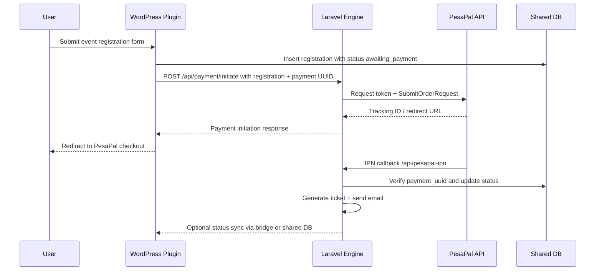

# Payment Integration with Laravel + PesaPal

## Overview

The event registration flow now keeps WordPress responsible for form capture and validation while the Laravel engine owns the payment orchestration. The WordPress plugin creates a registration row with a generated `registration_uuid` and `payment_uuid`, then calls the Laravel bridge to start a PesaPal order. The Laravel side authenticates with PesaPal, submits the order, and returns a redirect URL or tracking ID. The WordPress front-end then redirects the user to the payment page.

This keeps the public-facing registration flow, admin dashboard, and custom WordPress tables intact while centralizing the gateway logic, retry handling, idempotency, IPN validation, email/ticket generation, and audit logging in Laravel.

## Payment Flow Diagram



## WordPress → Laravel Bridge Mechanism

The bridge remains the established WordPress-to-Laravel communication layer:

- The WordPress plugin calls `wp_remote_post()` to the configured Laravel endpoint.
- The default bridge URL is surfaced in the admin Payment Settings page and can be overridden with `CER_LARAVEL_BRIDGE_URL`.
- The data sent is a JSON payload containing the registration UUID, payment UUID, attendee, amount, event/ticket metadata, and selected payment method.
- The Laravel controller validates the payload and submits the payment request to PesaPal through the gateway service.

In the current implementation, the bridge is a request-based interface using the existing Laravel public entry point at `laravel-engine/public/index.php` and the route definitions in the Laravel engine.

## Laravel Endpoints

The relevant API routes are defined in the Laravel engine:

- `GET /api/health` — health check
- `POST /api/payment/initiate` — create and start a PesaPal payment request
- `POST /api/pesapal-ipn` — receive IPN callbacks from PesaPal
- `GET /api/payment/status/{trackingId}` — fetch the current transaction status

Responsibilities:

- `PaymentController@initiate`
  - validates required registration/payment fields
  - calls `PesaPalService::submitOrder()`
  - returns JSON including `tracking_id`, `redirect_url`, and status

- `PaymentController@ipn`
  - validates inbound payloads and optional signatures
  - resolves the payment via `payment_uuid`
  - updates the store and prevents duplicate processing

- `PaymentController@status`
  - re-checks the transaction state from PesaPal for reconciliation jobs or retry scenarios

## PesaPal Service Layer

The core integration is implemented in:

- `laravel-engine/app/Services/Payment/PaymentGatewayInterface.php`
- `laravel-engine/app/Services/Payment/PesaPalService.php`

What it covers:

- token acquisition for PesaPal v3
- optional IPN registration helper
- order submission using the payment UUID as the idempotency key
- transaction status lookup
- optional HMAC verification helper for signed IPN payloads

The service is intentionally slim and extension-friendly so that additional gateways can be added behind the same interface later.

## Database Changes

The registration table was extended to carry the payment metadata needed to reconcile and retry transactions:

- `payment_uuid` — unique payment identifier generated at registration time
- `gateway_reference` — PesaPal tracking ID / order reference returned by the gateway

The relevant WordPress table is:

- `wp_evt_registrations`

The schema for the payment lifecycle is designed to keep the registration record as the source of truth while the Laravel engine handles payment state transitions. The plugin stores `status` values such as `awaiting_payment`, `paid`, `failed`, and `pending`, while the Laravel layer can map those to gateway-specific states for reconciliation.

## Configuration

Use environment variables for PesaPal credentials. In Laravel, define values in the engine environment file, for example:

```env
PESAPAL_BASE_URL=https://pay.pesapal.com/v3
PESAPAL_CONSUMER_KEY=your_consumer_key
PESAPAL_CONSUMER_SECRET=your_consumer_secret
PESAPAL_CALLBACK_URL=https://your-domain.com/laravel-engine/public/api/pesapal-ipn
PESAPAL_IPN_SECRET=your_ipn_secret
PAYMENT_DEFAULT_GATEWAY=pesapal
```

From the WordPress side, the plugin also exposes an admin Payment Settings page where you can set:

- Laravel bridge URL
- PesaPal base URL
- callback/IPN URL
- consumer key
- consumer secret

This keeps credentials out of source files and makes the setup environment-specific.

## IPN Setup in PesaPal

The IPN URL must be publicly reachable and HTTPS secured. The suggested endpoint is:

- `https://your-domain.com/laravel-engine/public/api/pesapal-ipn`

In PesaPal, register the endpoint as the callback destination for the site environment, then configure the same URL in the Laravel environment and WordPress admin settings. The Laravel IPN endpoint should acknowledge the callback with an HTTP 200 response and ignore duplicate `payment_uuid` values once the payment has already been completed or failed.

## Testing Instructions

### Sandbox flow

1. Configure sandbox credentials in the Laravel environment.
2. Activate the plugin and ensure `wp_evt_registrations` includes the new `payment_uuid` and `gateway_reference` columns.
3. Create or publish an event with at least one ticket type.
4. Open the registration page and submit a booking using M-Pesa or card.
5. Confirm that the submission is saved with status `awaiting_payment`.
6. Validate the Laravel bridge call reaches the `/api/payment/initiate` route and returns a redirect URL or tracking ID.
7. Complete the sandbox transaction and confirm the callback hits the IPN endpoint.
8. Verify that the registration status updates to `paid` and a ticket/email flow is triggered.
9. Check the payment logs and registration history for the expected audit trail.

### Failure scenarios

- cancelled payment
- insufficient funds
- duplicate IPN retry
- timeout from PesaPal
- invalid or missing signature

All of these should leave a log entry and a deterministic state transition, without creating duplicate tickets or repeated payment processing.

## Assumptions & Limitations

- The current codebase contains the gateway abstraction and route wiring, but live PesaPal sandbox credentials are still needed for an end-to-end validation run.
- The implementation is built to the project’s hybrid WordPress + Laravel architecture and intentionally keeps WordPress as the front door while Laravel owns the gateway logic.
- The platform still requires the normal ticket generation and email jobs to be fully wired to the event/ticket models for production readiness.
- PesaPal v3 specifics should be validated against the active merchant account configuration, as endpoint payloads and response contracts can differ by environment.

## Relevant Files

- [wp-content/plugins/custom-event-registration/custom-event-registration.php](../wp-content/plugins/custom-event-registration/custom-event-registration.php)
- [wp-content/plugins/custom-event-registration/includes/class-laravel-connector.php](../wp-content/plugins/custom-event-registration/includes/class-laravel-connector.php)
- [laravel-engine/app/Http/Controllers/PaymentController.php](../laravel-engine/app/Http/Controllers/PaymentController.php)
- [laravel-engine/app/Services/Payment/PesaPalService.php](../laravel-engine/app/Services/Payment/PesaPalService.php)
- [laravel-engine/routes/api.php](../laravel-engine/routes/api.php)
- [laravel-engine/routes/web.php](../laravel-engine/routes/web.php)
